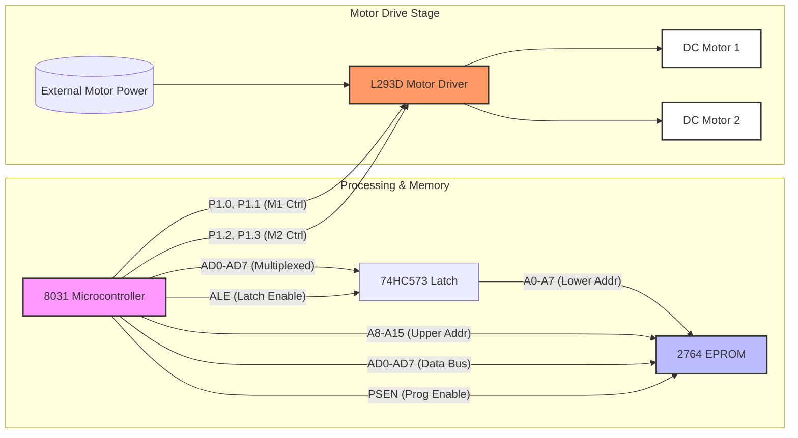

```mermaid
flowchart LR
    subgraph Processing & Memory
        MCU[8031 Microcontroller]
        Latch[74HC573 Latch]
        EPROM[2764 EPROM]
    end

    subgraph Motor Drive Stage
        Driver[L293D Motor Driver]
        M1[DC Motor 1]
        M2[DC Motor 2]
        Pwr[(External Motor Power)]
    end

    %% 8031 to Latch and EPROM Connections
    MCU ---> |"AD0-AD7 (Multiplexed)"| Latch
    MCU ---> |"ALE (Latch Enable)"| Latch
    Latch ---> |"A0-A7 (Lower Addr)"| EPROM
    MCU ---> |"A8-A15 (Upper Addr)"| EPROM
    MCU ---> |"AD0-AD7 (Data Bus)"| EPROM
    MCU ---> |"PSEN (Prog Enable)"| EPROM

    %% MCU to Motor Driver Connections
    MCU ---> |"P1.0, P1.1 (M1 Ctrl)"| Driver
    MCU ---> |"P1.2, P1.3 (M2 Ctrl)"| Driver

    %% Driver to Motors
    Pwr ---> Driver
    Driver ---> M1
    Driver ---> M2

    %% Styling
    style MCU fill:#f9f,stroke:#333,stroke-width:2px
    style EPROM fill:#bbf,stroke:#333,stroke-width:2px
    style Driver fill:#f96,stroke:#333,stroke-width:2px
    style M1 fill:#fff,stroke:#333,stroke-width:2px
    style M2 fill:#fff,stroke:#333,stroke-width:2px
```
